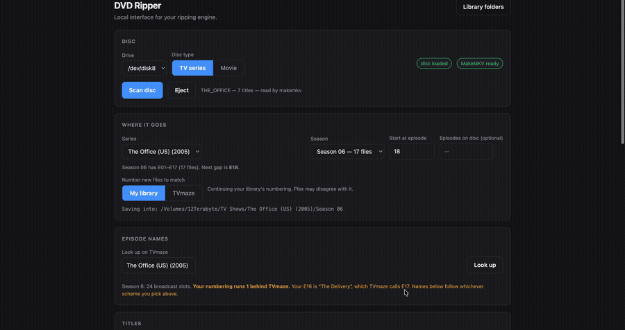

# DVD Ripper GUI 



A local, browser-based front end for a terminal DVD/Blu-ray ripping tool — built to make a personal media workflow usable without living in a terminal window.

## What it does

- Detects the optical drive and reports disc status
- Scans discs through MakeMKV (falling back to `lsdvd` for DVDs)
- Classifies titles automatically — flags play-alls and bonus content before you pick, using the same logic as the terminal engine
- Looks up the show on TVmaze and fills in real episode names, cross-referencing the disc's own play-all runtime as ground truth (more accurate than published minute-rounded runtimes)
- Runs rips with live progress and logging
- Logs to a shared local database so it stays in sync with the terminal version

## Why it's built the way it is

`server.py` doesn't reimplement the ripping engine — it imports the existing terminal program (`dvdrip.py`) unchanged and calls its functions directly. The GUI is a second interface on the same engine, not a fork of it, so a fix in one place is a fix everywhere. `server.py` runs a threaded HTTP server exposing a small JSON API, with `episodes.py` handling metadata reconciliation and `ui.html` as a single-file front end (no build step, no framework).

It's intentionally local-only: the server binds to `127.0.0.1` because it drives physical hardware and writes to the filesystem, so it's never exposed beyond the machine it's running on.

## Stack

Python (stdlib `http.server`, threading, `sqlite3`), vanilla JavaScript/HTML/CSS, MakeMKV/`lsdvd`/`ffmpeg` as external tooling.

## Running it

```bash
python3 server.py
```

Opens automatically at `http://127.0.0.1:8765`. Requires Python 3, MakeMKV, and an optical drive.

## License

All rights reserved — see [LICENSE](./LICENSE).
